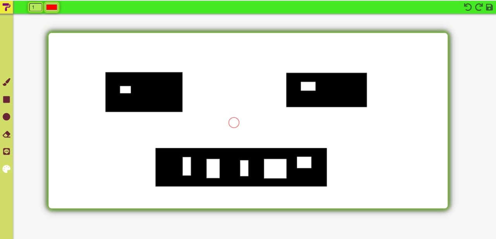

# Paint Online

> Paint Online - це веб застосунок, що дає можливість декільком людям працювати над одним холстом, наприклад, швидко візуально продемонстурвати те, що у 1 людини в голові іншій людині, коли вони знаходяться на відстані.

## **Основний розроблений функціонал можна побачити на цьому відео:**

## **Що тут можна робити?**

* Малювати
* Бистро висвітлювати свою ідею візуально для кращого розуміння
* Скидувати посилання на свій малюнок іншим людям і одночасно працювати над холстом, до цього всього, у кожного користуча зберігаються його стилі для малювання

------
#####Основа суть цього проекту продемонструвати можливості WebSocket протоколу.
------
